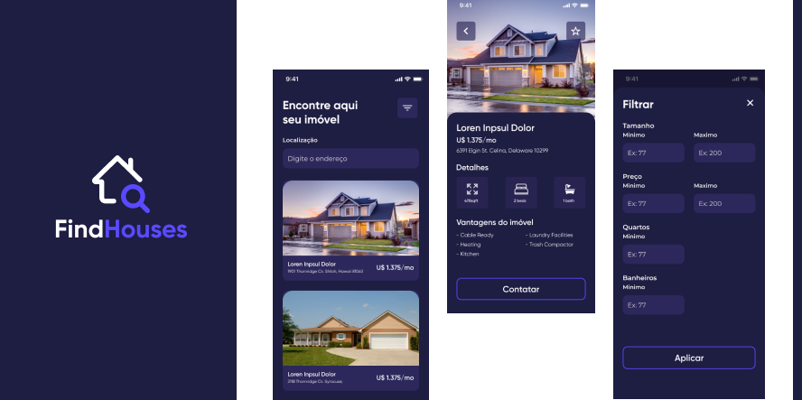

<h1 align="center">
    
</h1>
<h1 align="center">FindHouses 🏠 </h1>
<p>Aplicativo para busca de Imóveis desenvolvido na DevRiseWeek utilizando React Native para o desenvolvimento mobile e a Rest API Realtor obtida através da plataforma RapidAPI para poder buscar os imóvies.</p>

### Pré-requisitos

```bash 

# Antes de começar, você precisará ter instalado e configurado em sua máquina algumas ferramentas:

- Git
- Node.js
- Android Studio

# Após realizar o clone, acesse a pasta do projeto utilizando o terminal/cmd

$ cd pasta_projeto

# Instale as dependências

$ npm install ou yarn (Caso tenha o yarn instalado em sua máquina)

# Para executar a aplicação execute o comando abaixo com um emulador aberto ou dispositivo fisíco conectado via USB

$ npx react-native run-android ou yarn android

```

